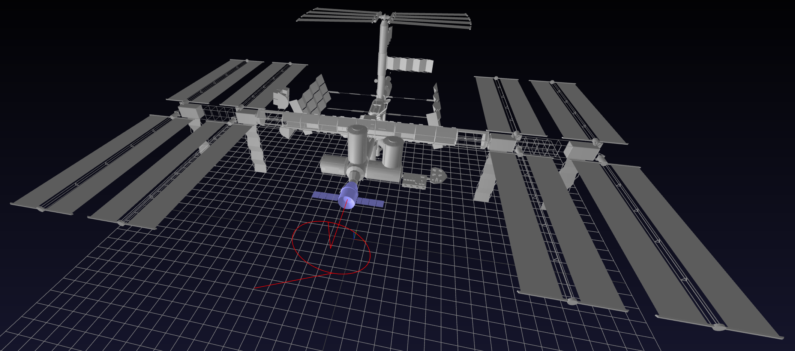

# Rendezvous_and_Docking_LQR
A simple example of LQR

## Installation

First, create a new conda environment with Python 3.12:

```bash
conda create -n lqr python=3.12 -y
conda activate lqr
```

Then, install the required packages:

```bash
pip install -r requirements.txt
```

## Usage

Inside the `main.ipynb` notebook, you can find the implementation of the LQR controller for spacecraft rendezvous and docking. You can run the notebook cells sequentially to see how the controller is designed and how it performs in simulation.


